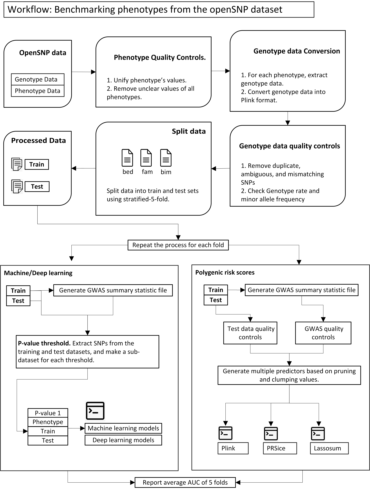

**Files**

1. **Analysis1.pdf** A complete list of all the phenotypes in the openSNP dataset.
2. **preTransform.csv** contains phenotypes and values. **postTransform.csv** contains phenotypes, values, and **transformed values**. 
3. **Analysis2.pdf** A complete list of all the phenotypes we transformed.
4. **Analysis3.pdf** A complete list of all the phenotypes after initial quality controls on genotype data.
5. **MachineLearningAlgorithms.txt** A complete list of machine learning algorithms.
6. **DeepLearningAlgorithms.txt** A complete list of deep learning algorithms.
7. **Plink_PRSice_Lassosum_Parameters.txt** A complete list of PRS tools paramters.

**Commands**
python Step 1 - Preprocessing.py
python Step 2 - Generate preTransform file.py
python Step 3 - Generate Classes.py

python Step 4 - Convert data to plink format.py Phenotype_Name
python Step 4 - Convert data to plink format.py ADHD

python Step 5 - List final phenotypes for analysis.py

python Step 6 - Generate p-values and GWAS.py Phenotype_Name
python Step 6 - Generate p-values and GWAS.py ADHD

python Step 7 - Use machine learning algorithm.py Phenotype_Name Iteration

python Step 7 - Use machine learning algorithm.py ADHD 1
python Step 7 - Use machine learning algorithm.py ADHD 2
python Step 7 - Use machine learning algorithm.py ADHD 3
python Step 7 - Use machine learning algorithm.py ADHD 4
python Step 7 - Use machine learning algorithm.py ADHD 5

python Step 8 - Get Machine Learning Results.py  Metric
python Step 8 - Get Machine Learning Results.py  MCC
python Step 8 - Get Machine Learning Results.py  AUC

python Step 9 - Use deep learning algorithm.py Phenotype_Name Iteration
python Step 9 - Use deep learning algorithm.py ADHD 1

python Step 10 - Get Deep Learning Results.py Metric
python Step 10 - Get Deep Learning Results.py AUC
python Step 10 - Get Deep Learning Results.py MCC

python Step 12 – CalculatePRSLassosum.py Phenotype_Name Iteration
python Step 12 – CalculatePRSLassosum.py  ADHD 1

python Step 12 -  CalculatePRSPlink.py Phenotype_Name Iteration
python Step 12 -  CalculatePRSPlink.py  ADHD 1

python Step 12 -  CalculatePRSPRSice.py Phenotype_Name Iteration
python Step 12 -  CalculatePRSPRSice.py  ADHD 1

python Step 13 -  GetPRSResults.py Metric ToolMetric Tool
python Step 13 -  GetPRSResults.py AUC PlinkAUC Plink
python Step 13 -  GetPRSResults.py AUC LassoumAUC Lassosum
python Step 13 -  GetPRSResults.py AUC PRSiceAUC PRSice  
