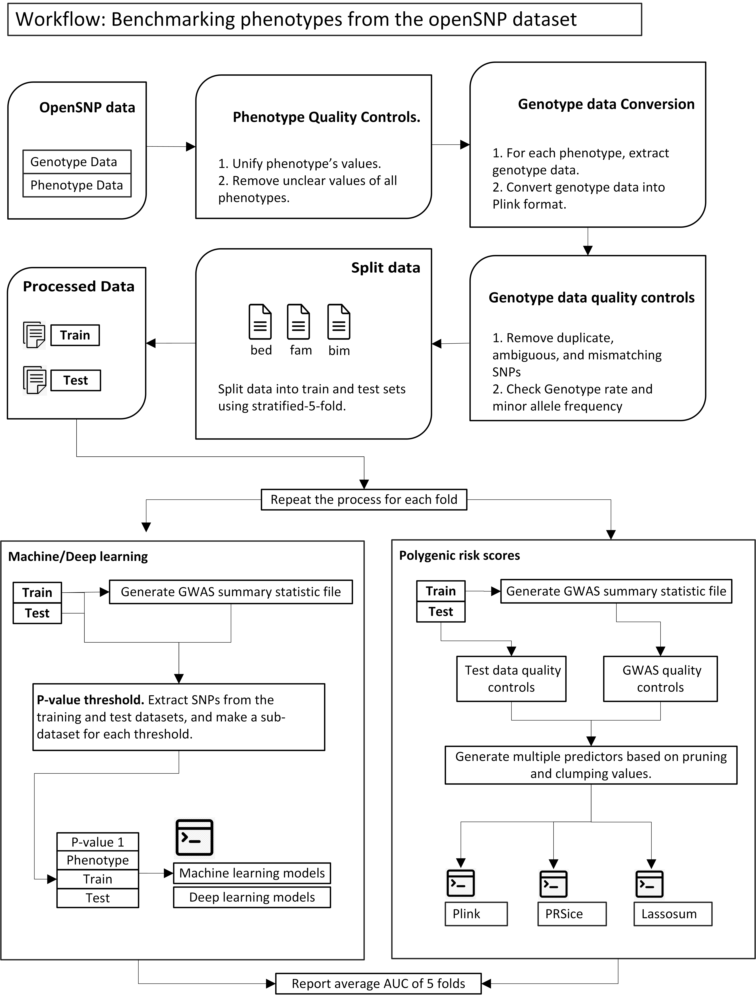

```markdown
# A Large-Scale Benchmark of Machine Learning, Deep Learning, and Polygenic Risk Score Workflows for 80 Binary Phenotypes in openSNP

**Muhammad Muneeb, David B. Ascher, YooChan Myung, Samuel F. Feng, Andreas Henschel**
 
[](https://github.com/MuhammadMuneeb007/Benchmarking-80-OpenSNP-phenotypes-using-deep-learning-algorithms-and-polygenic-risk-scores-tools)
[](https://opensource.org/licenses/MIT)

---

## Overview

This repository provides the complete code and documentation for benchmarking 29 ML algorithms, 80 DL model variants, and 3 PRS tools across 675 clumping and pruning configurations using 80 binary phenotypes from the openSNP cohort.

**Key finding: No single workflow family dominated universally. PRS workflows achieved higher AUC for 53 phenotypes, ML/DL for 26 phenotypes, but 41.2% of comparisons were practical ties within 5 AUC points.**

---

## Workflow



---

## Summary Results

### Overall Performance by Workflow Family

| Tool Family | Mean AUC (%) | Median AUC (%) | Mean CI Width | Total Wins | Decisive Wins (>5 AUC) |
|-------------|-------------|----------------|---------------|------------|------------------------|
| Plink | 68.15 | 66.67 | 31.37 | 35 | 11 |
| Machine Learning | 66.19 | 64.30 | 30.91 | 13 | 2 |
| Deep Learning | 65.29 | 64.60 | 27.50 | 14 | 3 |
| Lassosum | 63.70 | 63.37 | 26.71 | 18 | 10 |
| PRSice | 48.38 | 49.78 | 39.95 | 0 | 0 |

### Phenotype-Level Winners


### AUC Heatmap Across All 80 Phenotypes


### ML/DL Performance Grouped by SNP Subset


---

## Take-Home Messages

- **Plink** was the most consistently reliable PRS tool, achieving the highest mean AUC and the most phenotype-level wins
- **PRSice** performed poorly throughout, appearing as the lowest-performing tool for 63 of 80 phenotypes (78.8%), likely due to its SNP-count normalisation penalising low-genotype-rate data
- **Lassosum** collapsed to non-informative predictions (AUC = 50%, SD = 0) for 13 phenotypes (16.2%)
- **XGBoost** was the most frequently selected ML algorithm; **ANN** was the most frequently selected DL architecture
- **Sample size strongly influences performance**: peak AUC was negatively correlated with sample size (Pearson r = −0.60, Spearman ρ = −0.73)
- **No universal winner**: method selection should be phenotype-specific and guided by stability diagnostics, not just mean AUC

---

## Repository Structure

```
├── images/
│   ├── plot1.png          # ML/DL AUC grouped by SNP subset
│   ├── plot2.png          # AUC heatmap across all workflows
│   ├── plot3.png          # Phenotype-level winner counts
│   └── flowchart.png      # Pipeline overview
├── Analysis1.pdf          # All phenotypes in openSNP
├── Analysis2.pdf          # Transformed phenotypes
├── Analysis3.pdf          # Phenotypes after quality control
├── preTransform.csv       # Raw phenotype values
├── postTransform.csv      # Transformed phenotype values
├── AmbiguousPhenotypes.pdf
├── MachineLearningAlgorithms.txt
├── DeepLearningAlgorithms.txt
└── Plink_PRSice_Lassosum_Parameters.txt
```

---

## Requirements

```bash
pip install scikit-learn xgboost tensorflow pandas numpy scipy
```

PLINK, PRSice2, and Lassosum must be installed and accessible from the command line.

---

## Usage

Run the steps sequentially. Replace `ADHD` with your phenotype name and `1`–`5` with the iteration number.

### Step 1 — Preprocessing
```bash
python "Step 1 - Preprocessing.py"
python "Step 2 - Generate preTransform file.py"
python "Step 3 - Generate Classes.py"
```

### Step 2 — Convert to Plink Format
```bash
python "Step 4 - Convert data to plink format.py" ADHD
python "Step 5 - List final phenotypes for analysis.py"
```

### Step 3 — Generate GWAS Summary Statistics
```bash
python "Step 6 - Generate p-values and GWAS.py" ADHD
```

### Step 4 — Machine Learning
```bash
# Run 5 iterations per phenotype
for i in 1 2 3 4 5; do
    python "Step 7 - Use machine learning algorithm.py" ADHD $i
done
python "Step 8 - Get Machine Learning Results.py" AUC
```

### Step 5 — Deep Learning
```bash
for i in 1 2 3 4 5; do
    python "Step 9 - Use deep learning algorithm.py" ADHD $i
done
python "Step 10 - Get Deep Learning Results.py" AUC
```

### Step 6 — PRS Tools
```bash
for i in 1 2 3 4 5; do
    python "Step 12 - CalculatePRSPlink.py" ADHD $i
    python "Step 12 - CalculatePRSPRSice.py" ADHD $i
    python "Step 12 - CalculatePRSLassosum.py" ADHD $i
done
python "Step 13 - GetPRSResults.py" AUC PlinkAUC Plink
python "Step 13 - GetPRSResults.py" AUC PRSiceAUC PRSice
python "Step 13 - GetPRSResults.py" AUC LassoumAUC Lassosum
```

 

 
 

---

## Data Availability

Genotype and phenotype data are publicly available from [openSNP](https://opensnp.org/).

## License

MIT License
```
