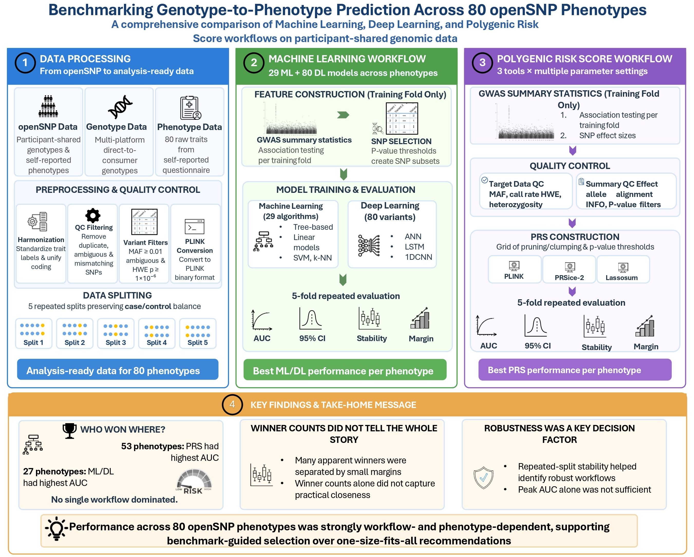
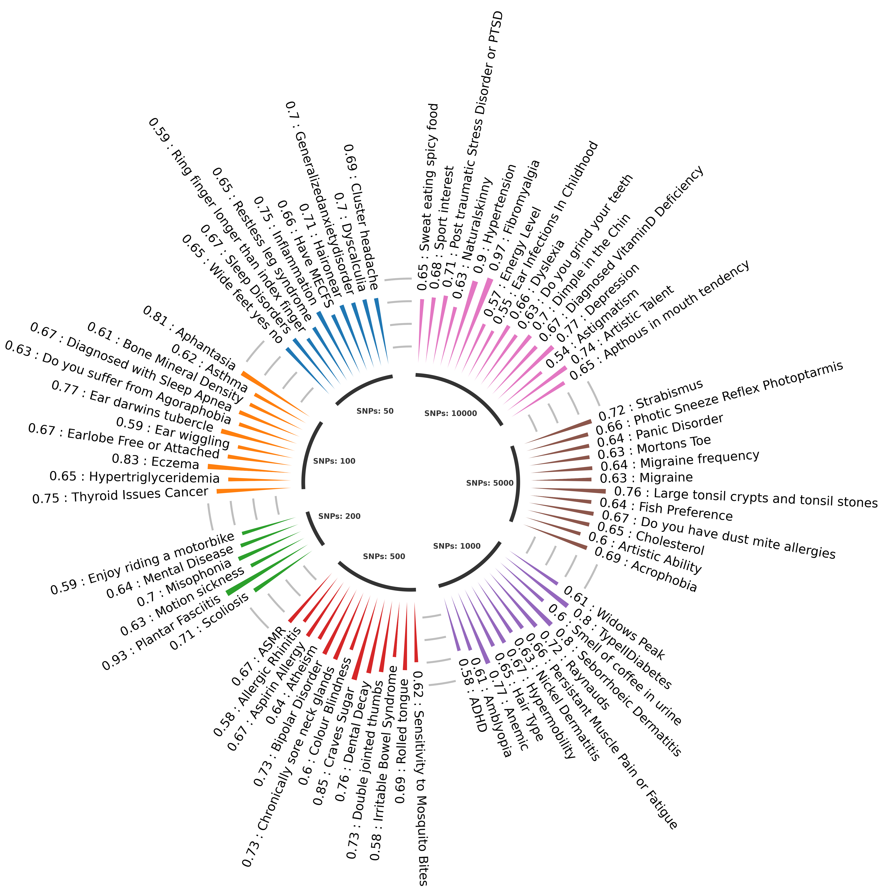

# Benchmarking Genotype-to-Phenotype Prediction Workflows Across 80 openSNP Phenotypes Using Machine Learning, Deep Learning, and Polygenic Risk Scores

**Muhammad Muneeb**

[](https://github.com/MuhammadMuneeb007/Benchmarking-80-OpenSNP-phenotypes-using-deep-learning-algorithms-and-polygenic-risk-scores-tools)
[](https://opensource.org/licenses/MIT)

---

## Overview

This repository contains the code, workflow definitions, parameter grids, and supporting material for a large-scale benchmark of genotype-to-phenotype prediction using the participant-shared openSNP dataset.

The benchmark evaluates:

- **80 binary phenotypes**
- **29 machine-learning algorithms**
- **80 deep-learning model variants**
- **3 polygenic score workflows:** Plink, PRSice2, and Lassosum
- **675 pruning and clumping configurations per PRS tool**
- **Five repeated stratified 75/25 train-test splits**

The study is designed as an **exploratory end-to-end workflow benchmark** under conditions of small sample size, heterogeneous genotype coverage, variable phenotype characteristics, and ancestry imbalance. It should not be interpreted as a clinical-validation study or as a definitive ranking of individual algorithms.

### Main finding

**No workflow family dominated universally.**

Polygenic score workflows achieved the highest observed AUC for **48 of 80 phenotypes**, while machine-learning or deep-learning workflows achieved the highest observed AUC for **32 of 80 phenotypes**.

However, **31 of 80 phenotypes (38.8%)** were practical ties, defined as a difference of no more than five AUC points between the best ML/DL and best PRS workflow.

---

## Workflow



The benchmark consists of three parallel workflow families:

1. Machine learning
2. Deep learning
3. Polygenic score construction

All workflows are evaluated using phenotype-specific train-test splits, with genotype preprocessing and feature or score construction performed within the corresponding workflow.

---

## Overall Performance

| Tool Family | Mean AUC (%) | Median AUC (%) | Mean CI Width | Total Wins | Decisive Wins (>5 AUC) |
|---|---:|---:|---:|---:|---:|
| Plink | 66.49 | 65.30 | 31.26 | 29 | 10 |
| Machine Learning | 66.19 | 64.30 | 30.92 | 14 | 2 |
| Deep Learning | 65.29 | 64.60 | 27.50 | 18 | 3 |
| Lassosum | 64.48 | 63.76 | 29.44 | 19 | 12 |
| PRSice | 48.17 | 49.01 | 40.37 | 0 | 0 |

### Phenotype-level winner counts

| Workflow | Phenotype Wins | Percentage |
|---|---:|---:|
| Plink | 29 | 36.2% |
| Lassosum | 19 | 23.8% |
| Deep Learning | 18 | 22.5% |
| Machine Learning | 14 | 17.5% |
| PRSice | 0 | 0.0% |

Collectively:

- **PRS workflows:** 48 / 80 phenotypes
- **ML/DL workflows:** 32 / 80 phenotypes

---

## Phenotype-Level Winners


The circular plot groups each phenotype according to the workflow family producing the highest observed AUC.

The complete phenotype-level AUC matrix is provided in the supplementary material rather than as a dense heatmap in the main manuscript.

---

## ML/DL Performance by SNP Subset



Machine-learning and deep-learning workflows were evaluated using phenotype-specific SNP subsets containing approximately:

- 50 SNPs
- 100 SNPs
- 200 SNPs
- 500 SNPs
- 1,000 SNPs
- 5,000 SNPs
- 10,000 SNPs

The SNP subset yielding the highest observed performance varied substantially across phenotypes.

---

## Practical Differences Between Workflow Families

Winner counts alone can overstate small differences between workflows.

When the best ML/DL workflow was compared with the best PRS workflow for each phenotype:

| Absolute AUC Difference | Phenotypes | Percentage |
|---|---:|---:|
| <1 point | 8 | 10.0% |
| 1–<3 points | 12 | 15.0% |
| 3–5 points | 11 | 13.8% |
| >5–10 points | 20 | 25.0% |
| >10 points | 29 | 36.2% |

Therefore:

- **Practical ties (≤5 AUC points): 31/80 (38.8%)**
- **Clear differences >10 AUC points: 29/80 (36.2%)**

---

## Paired Statistical Comparison

The best-performing ML/DL workflow and the best-performing PRS workflow were compared across the same 80 phenotypes using a paired Wilcoxon signed-rank test.

- Best ML/DL mean AUC: **68.12%**
- Best PRS mean AUC: **70.81%**
- Wilcoxon statistic: **W = 1196.0**
- **p = 0.0420**
- Effect size: **r = 0.227**

The difference reached nominal statistical significance but had a **small effect size**, reinforcing the importance of considering phenotype-level margins and uncertainty rather than relying solely on winner counts.

---

## Workflow-Specific Findings

### Plink

Plink achieved:

- Mean AUC: **66.49%**
- Median AUC: **65.30%**
- Phenotype wins: **29/80**
- Mean CI width: **31.26**

Plink achieved the largest number of phenotype-level wins among the five workflow families.

### PRSice2

PRSice2 achieved:

- Mean AUC: **48.17%**
- Median AUC: **49.01%**
- Phenotype wins: **0/80**
- Lowest-performing workflow for **62/80 phenotypes**
- Mean CI width: **40.37**

PRSice2 showed the broadest uncertainty in this benchmark.

One selected PRSice2 configuration was supported by only one valid fold. Its point estimate was retained, but its standard deviation and confidence interval were left undefined rather than being treated as zero.

The relatively weak PRSice2 results should be interpreted in the context of the small discovery samples, heterogeneous genotype coverage, missing-genotype handling, and score-construction settings used in this benchmark. They should not be interpreted as evidence that PRSice2 is intrinsically inferior in conventional, well-powered PRS studies.

### Lassosum

Lassosum achieved:

- Mean AUC: **64.48%**
- Median AUC: **63.76%**
- Phenotype wins: **19/80**
- Mean CI width: **29.44**

Lassosum exhibited a distinct failure mode in which **13 phenotypes** produced repeated non-informative predictions with:

```text
AUC = 50.0%
SD = 0
```

These cases were classified as model collapse rather than genuine stability.

### Machine Learning

Machine learning achieved:

- Mean AUC: **66.19%**
- Median AUC: **64.30%**
- Phenotype wins: **14/80**
- Mean CI width: **30.92**

The optimal algorithm and SNP subset were strongly phenotype-dependent.

**XGBoost** was the most frequently selected ML algorithm.

### Deep Learning

Deep learning achieved:

- Mean AUC: **65.29%**
- Median AUC: **64.60%**
- Phenotype wins: **18/80**
- Mean CI width: **27.50**

Deep learning showed the narrowest mean CI width among the five workflow families.

**ANN** was the most frequently selected deep-learning architecture.

---

## PRS Parameter Grid

All three PRS workflows were evaluated over the same **675 pruning and clumping configurations**.

The parameter grid used in the actual analysis was:

| Parameter | Values |
|---|---|
| Pruning window size | 200, 500, 1000 |
| Pruning window shift size | 50, 100, 150 |
| Pruning LD threshold | 0.1, 0.3, 0.5 |
| Clumping p1 | 1 |
| Clumping r² | 0.1, 0.325, 0.55, 0.775, 1.0 |
| Clumping kb | 200, 400, 600, 800, 1000 |

The complete grid therefore contains:

```text
3 × 3 × 3 × 1 × 5 × 5 = 675
```

configurations per PRS tool.

The exact parameter strings used during execution are stored in:

```text
Plink_PRSice_Lassosum_Parameters.txt
```

Examples:

```text
DL_1     200-50-0.1-200-1-0.1
DL_2     200-50-0.1-200-1-0.325
DL_3     200-50-0.1-200-1-0.55
DL_4     200-50-0.1-200-1-0.775
DL_5     200-50-0.1-200-1-1.0
```

The final configuration is:

```text
DL_675   1000-150-0.5-1000-1-1.0
```

---

## PRS Fold Handling

For ML and DL workflows, all five repeated split-level results were available.

For PRS workflows, some selected configurations had fewer than five valid fold-level results.

The aggregation rules used in the final analysis were:

- AUC = 0 is treated as a valid numerical result.
- Missing fold output is treated as unavailable, not as AUC = 0.
- The phenotype-level mean AUC is calculated from the available valid fold results.
- A configuration with one valid fold can retain a point estimate.
- Standard deviation and confidence interval are calculated only when at least two valid folds are available.
- Confidence intervals use the actual valid fold count and a Student's \(t\)-distribution with \(n-1\) degrees of freedom.

No missing PRS AUC value was converted to zero in the final analysis.

---

## Stability Diagnostics

The following diagnostic definitions were used:

### Model collapse

```text
Mean AUC = 50.0%
SD = 0
At least 2 valid folds
```

### Zero-SD non-collapse

```text
SD = 0
Mean AUC != 50.0%
At least 2 valid folds
```

### Wide confidence interval

```text
CI width > 40 AUC points
```

### Negative confidence interval

A lower confidence bound below zero was retained as a diagnostic indication of instability arising from symmetric t-based intervals applied to a bounded performance metric.

---

## Hyperparameter Concentration

Selected configurations differed substantially across workflow families.

| Workflow | Phenotypes | Unique Selected Configurations | Top Configuration Count |
|---|---:|---:|---:|
| Machine Learning | 80 | 79 | 2 |
| Deep Learning | 80 | 79 | 2 |
| Plink | 80 | 44 | 7 |
| PRSice | 80 | 8 | 73 |
| Lassosum | 80 | 26 | 14 |

PRSice showed particularly strong concentration, with one configuration selected for **73 of 80 phenotypes (91.2%)**.

---

## Sample Size and Performance

Sample-size metadata were available for **79 of the 80 final benchmark phenotypes**.

Amblyopia did not have a corresponding sample-size entry in the metadata table used for this analysis and was therefore omitted from sample-size analyses only.

For the best overall workflow:

```text
Pearson r  = -0.6170
Spearman ρ = -0.7454
```

Both associations were statistically significant with:

```text
p < 0.0001
```

The results therefore indicate that the largest observed AUC values were disproportionately concentrated among smaller phenotype datasets and should be interpreted cautiously.

---

## Dataset

openSNP is a participant-shared genomic database containing genotype files contributed by users of direct-to-consumer genetic testing services.

The analysis initially considered **83 candidate binary phenotypes**. Following genotype conversion and quality-control procedures, **80 phenotypes** were retained for downstream benchmarking.

The final cohort is predominantly of European ancestry, and the results should therefore not be assumed to generalise directly to populations with substantially different ancestry composition.

---

## Validation Design

The benchmark used five repeated stratified random train-test splits:

```text
Training = 75%
Testing  = 25%
```

Configuration selection and performance estimation were conducted within the same repeated-split framework.

Accordingly, reported AUC values are interpreted as **exploratory resampling estimates** rather than as estimates from a strictly nested or fully independent external validation design.

---

## Repository Structure

```text
├── images/
│   ├── plot1.png
│   ├── plot3.png
│   └── flowchart.png
│
├── Graphicalabstract.jpg
│
├── Analysis1.pdf
├── Analysis2.pdf
├── Analysis3.pdf
├── AmbiguousPhenotypes.pdf
│
├── preTransform.csv
├── postTransform.csv
│
├── MachineLearningAlgorithms.txt
├── DeepLearningAlgorithms.txt
├── Plink_PRSice_Lassosum_Parameters.txt
│
├── Step 1 - Preprocessing.py
├── Step 2 - Generate preTransform file.py
├── Step 3 - Generate Classes.py
├── Step 4 - Convert data to plink format.py
├── Step 5 - List final phenotypes for analysis.py
├── Step 6 - Generate p-values and GWAS.py
├── Step 7 - Use machine learning algorithm.py
├── Step 8 - Get Machine Learning Results.py
├── Step 9 - Use deep learning algorithm.py
├── Step 10 - Get Deep Learning Results.py
├── Step 12 - CalculatePRSPlink.py
├── Step 12 - CalculatePRSPRSice.py
├── Step 12 - CalculatePRSLassosum.py
├── Step 13 - GetPRSResults.py
│
└── Supplementary_Material_1.xlsx
```

File names may differ slightly between archived and resumable versions of the PRS execution scripts, but the analysis uses the common 675-configuration parameter file shown above.

---

## Requirements

Python dependencies include:

```bash
pip install pandas numpy scipy scikit-learn xgboost tensorflow matplotlib
```

External tools used by the pipeline include:

- PLINK
- PRSice2
- Lassosum
- R
- SNPTEST where required by preprocessing or summary-statistic generation

The exact software environment may depend on the operating system and compute environment.

---

## Usage

The following illustrates the main analysis sequence.

Replace `ADHD` with the phenotype directory and `1`–`5` with the corresponding split number.

### 1. Preprocessing

```bash
python "Step 1 - Preprocessing.py"
python "Step 2 - Generate preTransform file.py"
python "Step 3 - Generate Classes.py"
```

### 2. Convert genotype data to PLINK format

```bash
python "Step 4 - Convert data to plink format.py" ADHD
python "Step 5 - List final phenotypes for analysis.py"
```

### 3. Generate training-derived GWAS summary statistics

```bash
python "Step 6 - Generate p-values and GWAS.py" ADHD
```

### 4. Machine-learning benchmark

```bash
for i in 1 2 3 4 5; do
    python "Step 7 - Use machine learning algorithm.py" ADHD $i
done

python "Step 8 - Get Machine Learning Results.py" AUC
```

### 5. Deep-learning benchmark

```bash
for i in 1 2 3 4 5; do
    python "Step 9 - Use deep learning algorithm.py" ADHD $i
done

python "Step 10 - Get Deep Learning Results.py" AUC
```

### 6. Polygenic score workflows

```bash
for i in 1 2 3 4 5; do
    python "Step 12 - CalculatePRSPlink.py" ADHD $i
    python "Step 12 - CalculatePRSPRSice.py" ADHD $i
    python "Step 12 - CalculatePRSLassosum.py" ADHD $i
done
```

Aggregate phenotype-level PRS results after all available folds have been processed:

```bash
python "Step 13 - GetPRSResults.py"
```

The corrected aggregation procedure retains available valid fold results and does not convert missing PRS results to zero.

---

## Supplementary Material

The supplementary workbook contains **11 worksheets**:

| Sheet | Content |
|---|---|
| S1 | Dataset characteristics |
| S2 | Observed phenotype-level performance |
| S3 | Per-phenotype stability summary |
| S4 | Machine-learning stability results |
| S5 | Deep-learning stability results |
| S6 | Plink stability and selected PRS parameters |
| S7 | PRSice stability and selected PRS parameters |
| S8 | Lassosum stability and selected PRS parameters |
| S9 | Margin analysis |
| S10 | Confidence-interval and robustness sensitivity analysis |
| S11 | Combined phenotype-level risk summary |

The supplementary material contains the complete phenotype-level numerical results underlying the summary figures and tables reported in the manuscript.

---

## Important Interpretation Notes

This benchmark should be interpreted with several limitations in mind:

1. openSNP is a participant-shared, heterogeneous dataset with relatively small phenotype-specific cohorts.
2. Phenotypes are predominantly self-reported.
3. Genotyping platforms and genotype completeness vary between participants.
4. The cohort is predominantly of European ancestry.
5. PRS GWAS summary statistics were generated internally from training data rather than from large independent discovery cohorts.
6. Configuration selection and performance estimation were performed within the same repeated-split framework rather than within a fully nested validation design.
7. High AUC values observed in very small datasets may be unstable and should not be interpreted as evidence of clinical deployment readiness.

The repository is intended primarily as a **reproducible workflow benchmark and stress-test framework** for genotype-to-phenotype prediction under heterogeneous and limited-data conditions.

---

## Key Take-Home Messages

- **No universal winner:** predictive performance is strongly phenotype-dependent.
- **Plink achieved the most phenotype-level wins:** 29 of 80.
- **PRS workflows collectively won 48 phenotypes; ML/DL won 32.**
- **38.8% of phenotypes were practical ties within five AUC points.**
- **The best PRS vs best ML/DL comparison had only a small effect size despite nominal statistical significance.**
- **PRSice showed the broadest uncertainty and did not achieve a phenotype-level win.**
- **Lassosum showed non-informative model collapse for 13 phenotypes.**
- **ML and DL remained competitive with leading PRS workflows.**
- **Selected ML/DL configurations were highly phenotype-specific.**
- **High observed AUC values were enriched in smaller phenotype datasets and require cautious interpretation.**
- **Workflow stability and uncertainty should be considered alongside peak predictive performance.**

---

## Data Availability

The openSNP genotype and phenotype data used in this study are publicly available through openSNP and associated public database resources.

Database entry:

https://ngdc.cncb.ac.cn/databasecommons/database/id/4422

The code, transformation files, PRS parameter grid, workflow definitions, and supporting analyses are provided in this repository.

---

## Reproducibility

The repository contains the parameter definitions and scripts used for the reported analyses.

For the PRS workflows, the authoritative configuration grid is:

```text
Plink_PRSice_Lassosum_Parameters.txt
```

The file contains exactly **675 parameter combinations**, ranging from:

```text
200-50-0.1-200-1-0.1
```

to:

```text
1000-150-0.5-1000-1-1.0
```

When reproducing the benchmark, the parameter file should be retained unchanged so that configuration indices remain consistent with the reported results.

---

## Citation

If you use this code or benchmark, please cite the corresponding manuscript:

> Muneeb M, Ascher DB, Myung Y, Feng SF, Henschel A.  
> **Benchmarking Genotype-to-Phenotype Prediction Workflows Across 80 openSNP Phenotypes Using Machine Learning, Deep Learning, and Polygenic Risk Scores.**

A DOI and final journal citation will be added after publication.

---

## License

This repository is distributed under the **MIT License**.

See the `LICENSE` file for details.
